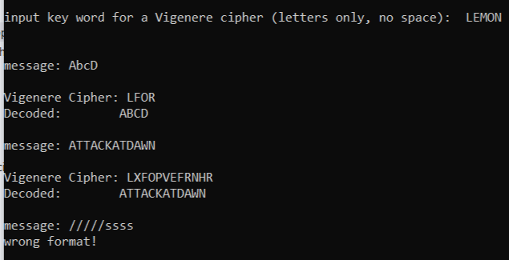

# Vigenere Cipher in Cryptography: C++ Implementation



The best explanation can be found here: [Vigenere Cipher in Cryptography](https://www.geeksforgeeks.org/vigenere-cipher/)

#### A quick recap on the algorithm:

- The table consists of the alphabets written out 26 times in different rows, each alphabet shifted cyclically to the left compared to the previous alphabet, corresponding to the 26 possible [Caesar Ciphers](https://github.com/naiderrp/Caesar-Cipher-Cpp-Implementation).
- At different points in the encryption process, the cipher uses a different alphabet from one of the rows.
- The alphabet used at each point depends on a repeating keyword.

***

The project uses file `example.txt` located in the same directory. It parses line by line to code and decode each message. Invalid keyboard and file input is handled using `std::regex_match`:
```
template<typename ReturnType>
auto validate_input(const std::string &message, const std::regex &pattern, const std::function<ReturnType(const std::string &)> &converter) {
	std::string input;
	
	do {
		std::cout << message;
		std::getline(std::cin, input);
	} while (!std::regex_match(input, pattern));

	return converter(input);
}
```
